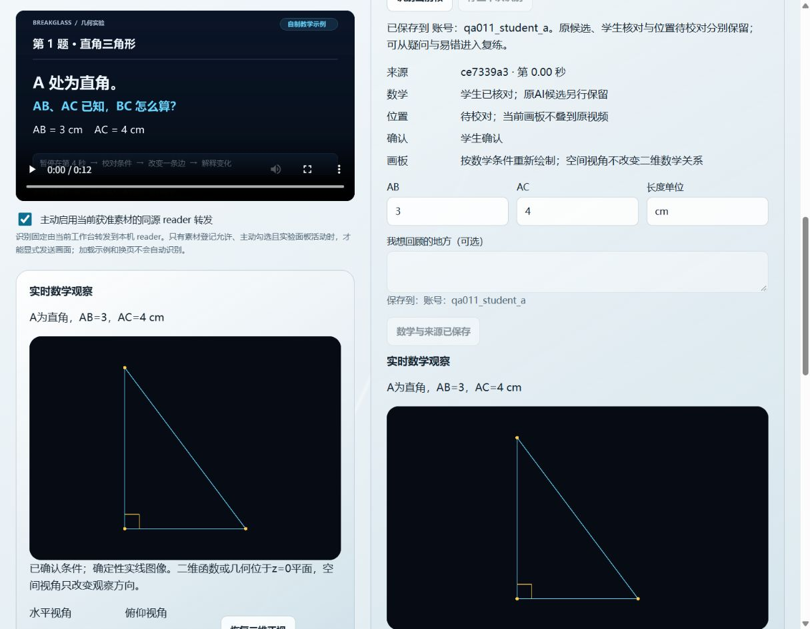

# 011 多会话首批实施验证

日期：2026-10-07。实施父提交 `b57b5a390cfb9b348239bdc2d1e0f3477e601ee6`，分支 `规划26年10月6`，治理2.6.3。本文对应本次代码树；非秘密代码/profile/提示/标定清单见 [implementation.json](test-evidence/011-implementation-2026-10-07/implementation.json)，最终提交可由本文件 Git 历史定位。原011规划审计与010证据保留，不能替代本次实现验收。

## 1. 分工与交付

复用了用户授权的两个现有协作会话，没有另开会话或让各组分别提交。同一工作目录按文件边界推进：学习组负责app/统一证据投影/flow草稿；页面组负责旧曲线与几何reader撤销、workspace保存范围和生命周期；当前会话负责冻结契约、reader模型/profile、新单帧网关、来源sidecar与新UI，并统一整合。内部助手做模型与网关实施、独立保存审查。所有组的Git和进程操作由当前会话统一执行。

- 学习投影同时校验旧attempt与新exercise/receipt，分别保存原数据，用命名空间去重。概览、错题、动态和复练共用口径；completion单列、辅助事实保留，观看/笔记/预测/未验证导入不计独立掌握。
- 旧曲线、几何读取和模型问答接许可代次与AbortController；停止、换源、换范围、隐藏和销毁拒绝迟到结果。已合法确认数学可保留手工学习，停止不等于删除历史。
- 新 `/api/vision/recognition` 使用011.1有限DTO。经典session可显式请求recognition-v1并绑定私有owner/epoch；新旧read共用32次额度与同一槽位。准备会话不采集、不同题型不重置额度，25秒客户端总截止从采集前开始，响应最多64KiB。
- 一般式/顶点式通过有限系数和程序换算得出数学候选，拒绝退化、溢出、accessor和未知表达式。profile只接受有限温度/推理/传输配置，缺配置或不支持inline时零供应商调用，不自动公开托管帧。默认温度0与旧契约/预算保持。
- 主demo和网站单帧入口分列来源、数学、位置与学生确认。核对后生成确定性二维与空间实线观察；当前函数或平面几何仍位于z=0。新候选位置全部unknown，使用独立数学画板；没有通过新的自动原位标定。单帧prepare延迟旧overlay，避免遮住新工作台。
- 来源元数据独立保存：原AI候选与学生修正后record分别保留，只有student-confirmed-candidate归因，没有模型准确性证明。local与account均校验父记录、来源/版本/时间、epoch和修订；清除/删父级联，退出不删历史，导出单独provenance。来源写入失败明确反馈，重试只补同一冻结记录；父题已删不能恢复旧writer。
- 当前保存范围常驻实际本机/具体账号。flow本机storage刷新与账号10秒可见刷新分开，保留同owner未提交输入/帮助事实；删除、换号和epoch隔离。新来源迁移尚未启用，旧迁移有限结构保持。

## 2. 程序验证

环境：Windows、Node v24.21.0，使用已有FFmpeg7.1。FFmpeg仅加入测试进程PATH，无新安装，无真实供应商请求。

```text
node --test --test-concurrency=4
node scripts/check.mjs
git diff --check
```

最终程序回归：**1206/1206通过，0失败/取消/跳过**。静态检查：**252个JS/MJS语法、401个本地引用及inline scripts通过**。完整程序日志经UTF-8/LF整理保存为 [node-tests.txt](test-evidence/011-implementation-2026-10-07/node-tests.txt)；不包含媒体、供应商密钥或账户令牌。单项初次失败与修复仍在相应负例中保留，不能把初次失败日志当成最终通过。

关键新增负例包括：许可off→on旧结果、请求与响应流取消、不同题型共额度、非法JPEG/宽641零模型调用、来源CSRF/跨账号/修订、幂等修订格式、写前父题删除、部分成功后备注冻结、用途后段失败后删父防复活、输入监听回收、重复初始化与失败恢复。旧真实JPEG及像素定位回归也执行；不代表新留出模型/原位质量通过。

## 3. 实际浏览器验证

通过computer-use的真实in-app浏览器操作，分别检查真实空模型主入口和隔离模型替身流程。隔离入口18769使用同一源码的frontdoor/account/gateway与自制三角形，唯一供应商函数是本机受控Response替身，账号与记录位于独立临时目录，不访问真实用户数据。

已观察：主8765可完整加载；空模型明确显示“视觉模型尚未配置”且不生成候选。替身路径经过主动勾选、单帧识别、学生确认、实线图像和local/account保存；不挂出旧浮层。已关闭识别后确认数学保留，换页可恢复保存的数学；新独立题实际错答反映概览“有答错证据1/需要复练1”及动态。账号保存显示具体测试账号，来源立即可刷新；确认的数学在同owner的账户可用性刷新后保留。DOM实际检查：1个video，无重复ID。

下图为**自制素材与受控模型替身的界面验证**，不是供应商识别准确率证据：



尚未完成全部真实跨标签/重新打开、旧曲线/几何问答取消、窄屏/减动效/全屏/DPR/四画幅或MV3验收。程序替身和DOM数量不能勾选这些外部项。

## 4. 本机运行与公网差异

已核对并重启当前仓库的8765 frontdoor和4174学习网关，原reader8787及lab4173未被更改，没有清除现有学习数据目录。网关仍为空模型本机开发模式；进程重启会使内存登录/配对/分析会话失效，持久学习数据仍由原数据目录管理。主入口：[http://localhost:8765/extension/demo/index.html](http://localhost:8765/extension/demo/index.html)。只有项目登记素材允许进入AI路径，B站处理授权待确认。

[公网资源核对](test-evidence/011-implementation-2026-10-07/public-site-comparison.json)记录2026-10-07实际HTTP响应：公网demo HTML与本地不同，workspace/app/新recognition模块的对应公网路径返回404。仅核对静态资源，不据此推断公网账户或模型能力。本次GitHub分支交付不等于部署公众服务；没有自动部署。

## 5. 剩余任务及回退

[011任务清单](../specs/011-recognition-reliability/tasks.md)按实际证据更新，本轮11项交付/实现完成，其余11项完整条件继续待验，部分已有代码。必须继续补：独立标注与校准/留出库、版本绑定性能/资源基线、新自动定位与ROI/四画幅、真实供应商全部接受/拒绝与成本、完整真实UI/跨标签/MV3、教师逐题及学生即时/延后评价。B站许可和大陆/海外正式发布继续独立审核，模型按用户决定留空可配置。

缺少题面数值或位置依据时，拒绝或回到独立数学画板；未配置/不支持/超时明确失败，不自动更换模型、重试堆积或延长预算。来源失败保留合法数学与清晰未确认状态；父记录删除或范围改变使旧操作失效。撤销停止传输，不悄悄删除已保存历史。学习统计只能来自有效实际作答，不由观看、漂亮图像或模型自述推断。
