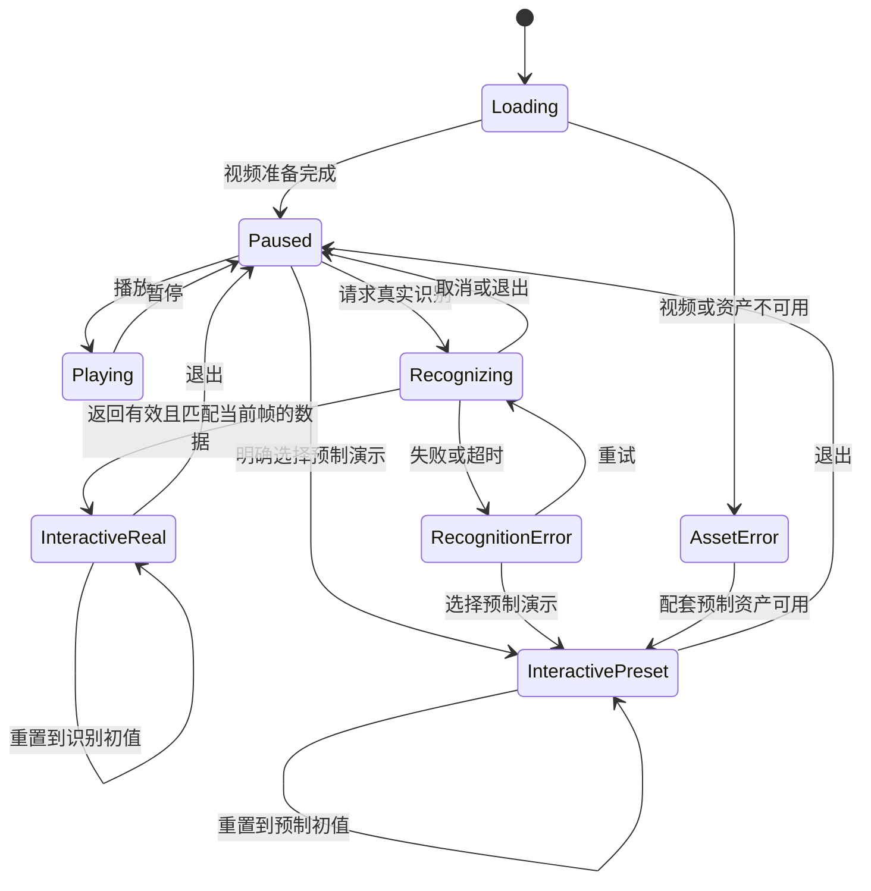

# BreakGlass（破壁）前端需求与落地分析

> 2026-10-06 最新产品规划：新插件与账号学习网站按两份 Constitution 2.1.0 原则 XI、[产品规划](./BreakGlass-immersive-learning-plan-2026-10-06.md) 和 [UI 规划](./BreakGlass-ui-plan-2026-10-06.md) 执行。本文件保留旧切片/历史分析的职责与预算；旧文中的无账号或仅演示限制不作为新产品目标的全局禁令。本次不实现新功能，也不改历史验收。

> 2026-10-06 治理复核：PR #63 的 [后续策略](./BREAKGLASS-next-strategy.md) 已归档；新范围按 Spec Constitution 2.1.0 原则 X / 产品 Constitution 2.1.0 准入。L1/L2/L3 尚未批准实施，当前扩展内演示页与各切片的真实模型、像素及学习证据分别验收；下文历史资料和验收状态保留。

> 2026-10-03 范围补充：下文保留 2026-10-01 前端分析的历史口径。用户选择“可验证的单场景闭环”并解除其仅前端限制；[005 当前帧直角三角形规格](../specs/005-insitu-right-triangle/spec.md) 覆盖视频关联、条件校对、几何解算、对话动作、本地 reader 与理解验证。最新范围按 [Constitution 2.1.0](BreakGlass-constitution.md) 和 Spec Constitution 2.1.0 执行，005 属原则 VIII，独立当前帧曲线按需识别属原则 IX；不将授权或规划写成验收通过。

## 2026-10-03 当前帧曲线分析补充

用户进一步明确“自由破壁”指任意暂停帧请求识别画面曲线。旧曲线页仅打开预读命中的稀疏点，修改目标时间不会重新识别；新需求需独立单帧请求，不能把演示预设绑定到用户视频当作识别。首版复用既有 `/read` 与抛物线校验器，在显式触发后发送一帧；30s 为开发默认，预读 300s 和原唤醒 1500ms 保持独立。方案、请求身份/时间/尺寸门禁、取消竞态与待真实模型验收见 [当前帧计划](./BreakGlass-current-frame-plan-2026-10-03.md)。本节不改下文历史分析或原任务完成情况。

## 2026-10-03 单场景闭环分析补充

- 图片中的差异化诉求是从视频这一题出发修改条件并理解原因；一比一复制全元素与多学科实验属于后续愿景。
- 现有仓库可复用本地视频、采帧、SVG、校验、取消与 reader 供应商接线。`lesson/ask.js` 是阅读 HTTP 请求，不是学生聊天；现有曲线定位不是几何约束解算。
- 005 的核心新增为独立 SceneResult、识别校对、AB/AC 同单位条件、保持直角的确定性计算、自然语言白名单动作和学习返回流程。图片不按比例绘制时不得用像素量长度。
- 004 更多图形与旁边提问已在目标分支存在，其不识别新图形和两人分工范围保持独立；005 不覆盖它。
- 真实模型接入、合法视频素材与供应商数据保留策略仍需验证。历史自动化和预制演示记录不证明新几何流程已完成。

005 本轮已实现独立工作台、确定性算法、当前帧校对与本地 reader 接口；预设网页流程及替身自动化已有证据，真实模型与完整产品验收尚未通过。当前状态见 [任务清单](../specs/005-insitu-right-triangle/tasks.md) 和 [几何验证记录](./BreakGlass-geometry-validation.md)，不以本分析推断完成。

- 分析日期：2026-10-01。
- 分析对象：学军黑客松产品团队资料文件夹中的七份文档及两个画板入口。
- 项目边界：遵守根目录 AGENTS.md，仅分析和规划前端实现；后端、数据库和识别服务建设属于外部依赖。
- 资料状态：主要需求、流程和交互说明仍标为讨论中或待团队确认。本报告区分资料事实、分析判断与建议方案，不将建议视为已冻结需求。
- 本次工作：只读查看飞书资料并生成本地报告，未修改飞书文档，未实现或运行前端产品。

## 1. 核心判断

**建议围绕一个受控抛物线视频，完成可重复演示的前端交互闭环。**

本报告后续执行以 [`BreakGlass-constitution.md`](./BreakGlass-constitution.md) 为治理基线：数学抛物线是 P0 唯一交付门槛；Python/Pyodide、真实视觉识别和代码执行是独立 P1，不能反向扩大 MVP。每个交互节点都需要明确的 `enableLocalMock` 配置，超时保底必须标明“本地预制”，不能把模拟结果描述为真实识别。

资料中的产品意图是：把学习视频里的数学曲线变成可操作对象，让用户通过改变参数理解曲线变化。当前候选 MVP 已集中到单个预设抛物线场景，而不是任意视频识别或代码运行平台。[S1][S2][S5]

前端可以先完成视频、暂停定位、SVG 交互和明确标注的预制数据模式；真实识别接入则需要接口与数据契约。能演示一条预制曲线，不等于已经识别任意视频，也不等于实现纯本地识别。

目前最需要解决的不是增加页面，而是统一范围与行为、准备真实演示资产、确定坐标契约，并落实分工。

## 2. 已查看的资料与来源

| 编号 | 文档 | 本次看到的情况 |
| --- | --- | --- |
| S0 | 00 项目导航 | 仍写产品与赛题尚未确定；导航表多数状态为待填写，与后续文档不一致 |
| S1 | 01 需求文档 | 已有 BreakGlass 定位、教育场景、R-01 至 R-05、MVP 和验收项；状态为讨论中 |
| S2 | 02 业务流程图 | 已写 F-01 至 F-05 主流程及异常分支；画板状态仍待绘制 |
| S3 | 03 页面原型 | 已列 P-01 至 P-05 和交互说明，但原型链接及设计人待补充 |
| S4 | 04 任务分工 | 人员、任务内容、截止时间、负责人和里程碑细节基本未填 |
| S5 | 05 演示脚本 | 已有约 80 秒的时间轴、问题回答和离线保底设想；排练记录仍为空 |
| S6 | 06 宣传片脚本与素材清单 | 创意、分镜和素材仍为模板占位 |
| S7 | 业务流程图（画板） | 可见的是开始、流程、判断、结束等通用模板节点，未体现产品实际步骤 |
| S8 | 页面原型（画板） | 加载完成后的页面明确显示空白画板，未看到具体界面设计 |

来源链接用于追溯，内容可能在本报告之后更新：

- 文件夹：https://my.feishu.cn/drive/folder/RLmAfNeOOl6NmodRBfxcKTu9nyg
- [S0 项目导航](https://my.feishu.cn/docx/GZsVdjMCqoTMITx1tG8cNoWKnvg)
- [S1 需求文档](https://my.feishu.cn/docx/Afhkdk1OVoI985xFAWtcSLQun7e)
- [S2 业务流程图](https://my.feishu.cn/docx/CT7pdsyWmo69rKxEGhYcLXfQnvg)
- [S3 页面原型](https://my.feishu.cn/docx/NXhydXiFBoe4BoxffAQcU1H2nCh)
- [S4 任务分工](https://my.feishu.cn/docx/LmMrd4nvJoI4IRxjj7Pcdb15nrH)
- [S5 演示脚本](https://my.feishu.cn/docx/Q4aZdLc8xoEIk2xeiG6cXKcKnDc)
- [S6 宣传片脚本与素材清单](https://my.feishu.cn/docx/FBBDd6b4zoW9PpxJl9uc1vgtngd)
- [S7 流程画板](https://my.feishu.cn/docx/XUKHd3vDgogvjcxqlsgcnjCHnQd)
- [S8 原型画板](https://my.feishu.cn/docx/JXXMdsDGuoIbY2xnNVdc52HJntd)

## 3. 产品方向与前端价值

### 3.1 从观看转为操作

演示需要让观众直接看到：视频中的某条曲线，在暂停后成为可以调整的对象，参数变化又能即时映射到图形。相比单纯显示识别文本，原位对齐与可操作性更接近本项目想表达的学习价值。[S1][S3]

建议把成功体验定义为三个连续结果：

1. 看得出交互曲线对应原视频中的哪条曲线。
2. 能操作一个明确参数，并立即看到变化。
3. 能恢复初始状态，比较操作前后并继续播放。

其中第 2、3 项是前端可直接交付的能力；自动识别的真实性与准确性必须另行验证。

### 3.2 本轮不扩展的范围

依据候选 MVP，暂不规划任意视频接入、多个数学对象、代码沙盒或同时完成代码与数学两个场景。[S1][S2]

此外，当前资料未要求账号体系、内容库、管理后台或数据库；本仓库不因分析任务而新增这些模块。

## 4. 文档成熟度与开工条件

| 维度 | 判断 | 对前端的影响 |
| --- | --- | --- |
| 产品方向 | 已有候选方向，但未冻结 | 可以做受控原型，避免把长期愿景当成当前范围 |
| 主流程 | 已有文字步骤 | 可用于状态设计，仍需统一具体行为 |
| 视觉设计 | 有文字布局建议，画板尚无产品设计 | 不能宣称已经有高保真稿或已确定品牌风格 |
| 演示资产 | 未在已读资料中发现实际视频、帧图及完整参数资产 | 原位对齐与真实演示尚缺关键输入 |
| 识别接入 | 有 Vision API 设想，但无可用接口契约 | 可以设计前端适配层，不能宣称真实识别已接通 |
| 分工与时间 | 有比赛时间和粗粒度节点，任务表未落实 | 无法依据现有资料确定具体责任人和实施进度 |
| 本地代码 | 本次工作前，当前目录仅看到 AGENTS.md | 当前本地尚无可验证的前端工程或已选择技术栈 |

上述判断仅针对本次可见的文档及当前目录，不代表团队在其他仓库中没有代码或资产。

## 5. 必须统一的需求冲突

| 问题 | 证据 | 影响 | 建议处理 |
| --- | --- | --- | --- |
| 真实识别是否必须 | S1 核心功能把识别列为 P0；风险说明又将其作为增强 | 两种实现目标的工作量和验收结论不同 | 分开定义前端交互闭环与真实识别能力；团队明确识别是否为交付门槛 |
| 重置与退出的优先级 | S1 核心表列为 P0，R-05 明细列为 P1 | 必要的恢复能力可能被排到后面 | 建议两者都纳入最小闭环，按 P0 安排 |
| 重置的行为 | S1 验收描述把重置与退出混用；S2 描述重置初始曲线或退出交互层 | 容易出现按钮行为和验收不一致 | 建议重置只恢复参数并保留交互层，退出才返回暂停画面 |
| 识别时长与现场脚本 | S1 允许 60 秒内出现结果；S5 核心展示时段仅约 20 秒 | 即使技术验收通过，也可能拖垮现场演示 | 单独定义现场等待预算和超时路径；现场采用可预测的数据模式 |
| 截图保底不足以证明交互 | S1、S2、S5 提到预制截图或本地演示，但资产未列明 | 只有图片无法完成拖动、调参和重置 | 保底必须配套曲线参数、坐标映射和可交互页面 |
| 导航与实际内容不同步 | S0 仍标产品未定，而 S1 已有候选产品 | 团队可能依据过时入口理解范围 | 同步导航为候选方案讨论中，并补充有效文档状态 |
| 文档中有页面编号但无设计稿 | S3 已列 P-01 至 P-05；S8 实际为空白 | 容易把页面清单误认为已完成原型 | 补一张工作台线框图及状态变体，保持编号可追溯 |
| 执行责任未落实 | S4 大量任务字段空缺，S6 素材清单未填 | 视频、识别结果和前端对接可能同时等待他人 | 为关键资产与前端任务指定负责人、时间和依赖，不在本报告中臆造人名 |

## 6. 建议的页面组织

**建议采用一个演示工作台和多个状态，而不是五个独立业务页面。**这是对 S3 页面编号的前端组织建议，需要在设计中明确。[S3]

| 资料编号 | 对应的前端状态或区域 | 内容 |
| --- | --- | --- |
| P-01 | 演示工作台 | 视频区域、操作条、简洁产品说明 |
| P-02 | 暂停状态 | 当前帧、破壁入口、目标帧定位入口 |
| P-03 | 处理中状态 | 加载反馈、取消入口及等待说明 |
| P-04 | 可交互状态 | SVG 曲线、参数控制、数值显示和重置 |
| P-05 | 错误或退出状态 | 明确错误信息、预制演示入口、退出后恢复 |

建议界面包含：

- 主区域：视频与 SVG 共用的显示舞台，避免交互层脱离视频。
- 控制条：播放、暂停、目标帧定位、破壁、重置、退出。
- 参数区：参数名称、当前值、调整控件及简短含义说明。
- 状态区：识别或预制数据来源、加载、错误与回退说明。

桌面优先可作为比赛演示的建议方案，但目标设备、分辨率及是否要求手机操作尚未在资料中确定。框架、UI 库和品牌样式同样未确定，不在分析阶段替团队固化。

## 7. 建议的前端状态模型

以下为建议实现模型，并非飞书已经确认的状态规范。

实施时需要统一的行为：

1. 交互层开启期间保持目标帧稳定，避免视频播放后曲线仍覆盖在旧位置。
2. 重复点击破壁不得叠加多个互相覆盖的识别任务。
3. 切换帧、取消识别或退出后，旧请求即使返回也不能覆盖当前状态。
4. 参数值和图形来自同一份状态，避免滑块、数字和 SVG 不一致。
5. 重置恢复当前结果的原始参数，不依赖重新识别。
6. 退出移除交互层并恢复合理焦点；是否继续播放应统一约定，建议默认保持暂停。
7. 预制演示状态使用持续可见的数据来源标识，不仅显示一次短暂提示。

## 8. 最值得提前验证的技术问题

### 8.1 曲线和视频能否对齐

这是前端体验的主要风险之一。识别结果只给出一个公式，仍不足以决定曲线该画在视频的哪个位置。

建议明确区分三个坐标空间，并遵循 Constitution 的页面支持边界：

- 原始帧坐标：以原始视频帧尺寸为依据的像素位置。
- 数学坐标：曲线参数、坐标轴范围及其单位。
- 页面显示坐标：视频在浏览器中实际占据的区域。

前端应按同一映射处理 SVG 绘制与拖动输入，并验证缩放、留白和窗口变化后的对齐。图形位置不能只按视频外层容器宽高粗略换算。首版只承诺已验证域名和可访问的 `<video>`；跨域 iframe、Shadow DOM、DRM 和权限不足的媒体不纳入验收。

### 8.2 拖动具体改变什么

资料要求拖动曲线或参数，但尚未定义拖动操作的数学含义。[S1][S2][S3]

建议首版采用顶点式 y = a(x - h)^2 + k：

- a 控制开口方向与宽窄。
- h、k 控制顶点的横向与纵向位置。
- 顶点拖动调整 h、k，滑块调整参数；是否支持整条曲线拖动单独确认。
- 对参数范围和步长进行限制；若仍称为抛物线，应明确 a = 0 的处理方式。

这只是建议参数化方式，实际初值、范围和公式形式应来自最终视频及确认的数学场景。

### 8.3 预制模式与真实识别共用呈现逻辑

建议两种数据来源都返回同一类前端结果，由同一套曲线渲染和参数控件展示。区别体现在数据来源标识、请求状态与错误处理，不应维护两套容易分叉的交互界面。

### 8.4 离线保底需要完整资产

保底包建议包含视频或对应静态帧、参数初值、坐标映射、参数范围及前端静态资源。只有截图不能替代交互。是否真正能断网运行，需实际启动并检查资源依赖后才能说明。

## 9. 建议的数据契约与外部依赖

本节是用于前后端或算法协作的建议清单，**不是已存在的服务、端点或已确认 JSON 格式**。不在本仓库创建业务后端，也不将服务端密钥放入浏览器。

| 建议信息 | 含义 | 前端用途 |
| --- | --- | --- |
| 视频标识和目标时间 | 当前操作对应的素材与时间位置 | 防止结果应用到错误视频或错误帧 |
| 请求标识 | 对应一次识别操作 | 丢弃已取消或过期的结果 |
| 帧宽度、帧高度 | 原始截图的尺寸 | 统一图形映射依据 |
| 图形区域 | 坐标图在原始帧中的位置与尺寸 | 确定 SVG 覆盖范围 |
| 数学坐标范围与方向 | 坐标轴范围、原点或等效映射定义 | 完成数学坐标与像素坐标转换 |
| 曲线类型与参数 | 抛物线定义及数值 | 绘制和参数联动 |
| 参数范围和步长 | 每个参数允许的操作区间 | 避免越界及无效曲线 |
| 数据来源 | 真实识别或预制示例 | 持续显示可信的状态说明 |
| 错误类型与可恢复性 | 失败、超时、无支持对象等情况 | 展示重试、取消或预制演示入口 |

结果进入交互层之前，建议检查：关键尺寸有效、参数为有限数值、坐标范围可用、结果匹配当前请求、曲线类型属于本轮支持范围。

如果服务提供可信的置信度或质量指标，可以展示；没有这些信息时不能在前端编造识别准确率。

待外部明确的事项：识别在本地还是云端、接口接入方、是否上传视频帧、数据保留方式、输入限制及真实错误样例。前端只实现确认后的对接、提示与状态处理。[S1][S5]

## 10. 开工需要的最小素材包

| 资产 | 必须明确的内容 | 缺失时的影响 |
| --- | --- | --- |
| 演示视频 | 实际文件、可使用来源和预期播放环境 | 无法验证完整播放流程 |
| 目标帧 | 目标时间或定位规则、对应截图 | 无法验证识别对象与交互层是否一致 |
| 曲线定义 | 实际公式、参数初值、取值范围 | 只能做没有业务依据的占位交互 |
| 坐标说明 | 图形区域、数学范围及映射依据 | 原位叠加容易产生偏移 |
| 保底结果 | 配套帧图、参数和标识文案 | 失败后可能只剩静态图片 |
| 识别样例 | 真实成功和错误结果，或明确尚不可用 | 只能验证预制数据路径 |
| 演示设备 | 目标浏览器、屏幕与网络条件 | 无法确定现场验证范围 |

已读资料没有提供以上完整资产包。应向相关负责人取得或明确由谁制作，而不是把建议参数伪装成视频识别结果。

## 11. 前端模块与任务拆解

以下是候选任务，不是已经完成的工作；优先级为本报告建议。

| 编号 | 工作内容 | 前置条件 | 完成证据 |
| --- | --- | --- | --- |
| FE-01 | 建立前端工程和演示工作台 | 技术栈、目标运行方式 | 本地可启动，基础布局和脚本可用 |
| FE-02 | 播放、暂停和目标帧定位 | 实际视频与目标帧 | 使用真实素材完成一次定位 |
| FE-03 | 受控预制结果与来源标识 | 配套参数和帧图 | 明确进入预制模式，数据可追溯 |
| FE-04 | SVG 曲线和坐标转换 | 公式、图形区域、坐标契约 | 初始曲线与视频对应位置一致 |
| FE-05 | 参数控件与拖动联动 | 参数范围和操作定义 | 数字、控件和曲线同步更新 |
| FE-06 | 重置、退出与取消 | 行为统一 | 恢复初值、退出和重新进入可重复 |
| FE-07 | 加载、错误、超时与保底 | 错误语义及保底资产 | 异常路径可操作且不误报成功 |
| FE-08 | 真实识别的前端适配 | 可用契约和外部识别能力 | 真实结果进入同一交互层，旧请求不污染当前状态 |
| FE-09 | 布局、键盘与现场检查 | 主流程稳定 | 目标环境下可完成演示和恢复 |
| FE-10 | 演示彩排与交付说明 | 前端构建及最终素材 | 记录实际时长、数据模式和未实现能力 |

建议先完成 FE-01 至 FE-07 的可控路径，再接入 FE-08。若真实识别被团队确认为交付门槛，其外部提供方必须同时推进，不能等前端完成后才开始明确契约。

## 12. 实施顺序与比赛时间

资料写明比赛从 10 月 1 日 22:00 开始，持续 48 小时。结合文档记录日期，本报告理解为 2026-10-01 22:00 开始；若同一时区连续计时 48 小时，推算结束时间为 2026-10-03 22:00。实际提交截止仍需对照赛事通知。[S1]

不在缺少人员与资产信息时给出确定工期，建议按依赖推进：

1. **范围与素材落实**：明确数学单场景、真实识别是否必做、重置与退出行为，以及视频和参数来源。
2. **最小交互验证**：先在受控数据上验证曲线绘制、调参与重置。
3. **视频原位融合**：接入素材和帧定位，完成坐标对齐及缩放检查。
4. **识别与异常接入**：在统一结果契约上对接真实识别，补齐取消、超时和来源标识。
5. **演示稳定化**：验证保底资产，限制无关功能变化，按 S5 时间轴完整彩排。

S1 的 M1、M2、M3 已有粗粒度日期，但 S4 尚未同步成有负责人的具体任务。建议通过同一份任务表落实进度，不把文档中的未开始状态当成团队实际开发情况的唯一证据。

## 13. 建议验收场景

| 场景 | 期望结果 | 性质 |
| --- | --- | --- |
| 加载预设视频 | 显示正确素材，能播放和暂停 | 资料要求 |
| 定位指定帧 | 操作进入预定演示位置，结果与帧对应 | 资料要求，定位容差待定 |
| 破壁结果呈现 | 当前受支持场景出现曲线与参数；S1 技术上限为 60 秒 | 资料要求，需与演示预算协调 |
| 调参或拖动 | 曲线和参数同步变化 | 资料要求 |
| 重置 | 参数恢复原始结果并保留交互层 | 本报告建议，需统一 |
| 退出 | 移除交互层并回到暂停状态 | 本报告建议，需统一 |
| 识别失败 | 明确提示失败，提供可操作的预制模式 | 资料保底方向加前端透明性要求 |
| 取消或切换帧 | 已过期识别结果不会再次覆盖界面 | 本报告建议 |
| 识别超过 1.5 秒 | 自动接管预热的本地 JSON，并显示“本地预制/超时回退” | 体验不中断，但不得伪装为识别成功 |
| 调整窗口大小 | 曲线相对视频中图形的位置保持正确 | 本报告建议 |
| 预制模式 | 用户始终能辨认数据来源，仍可调参和重置 | 本报告建议 |
| 网络不可用 | 若宣称离线演示，实际断网条件下依然完成受控流程 | 依据 S5 保底设想验证 |
| 连续彩排 | 按约 80 秒脚本实际记录时长，能恢复并再次开始 | 依据 S5 的验证建议 |

本报告未执行上述测试，不给出通过率、性能评分、识别准确率或已通过验收的结论。

## 14. 待确认事项

### 14.1 直接影响最小交付

1. 是否正式确定只做数学抛物线场景？
2. 真实识别是必须交付的能力，还是可以明确标识的增强路径？
3. 哪个视频、哪一帧、哪组曲线参数作为正式演示资产？
4. 参数用哪一种数学形式，拖动顶点或整条曲线分别改变什么？
5. 重置是否保留交互层，退出后是否保持暂停？
6. 现场能够接受的识别等待时间和保底切换方式是什么？

### 14.2 影响对接和呈现

7. 识别服务由谁提供，是否上传视频帧，接口与坐标结果何时可用？
8. 演示使用什么设备、浏览器和网络，是否要求手机或触屏？
9. 视频、原型、算法结果和前端各由谁负责？
10. 本轮是否需要宣传片，前端需提供哪些真实录屏画面？

这些问题不阻止继续做独立的前端验证，但应在依赖它们的实现和验收前落实。

## 15. 文档与 Spec Kit 后续衔接建议

- 把已经选定的前端范围、未确认点和验收条件写进需求规格，避免将长期愿景复制成当前任务。
- 将本报告中的状态模型、坐标契约和模块边界转成实施计划。
- 将 FE 任务细化为可执行的前端清单；识别服务和视频资产列为外部依赖。
- 为 S0 同步产品候选状态，为 S3 补充真正的线框稿，为 S4 落实人员与截止时间。
- 保持演示脚本中的能力表述与当前真实模式一致，不把预制演示称为识别成功。
- 本次没有初始化 Spec Kit，没有冻结团队需求，也没有更改项目的前端专属职责。

## 16. 本次分析的交付边界

已完成：读取公开可访问的资料内容、核对画板实际状态、交叉比较需求与演示口径、提出前端方案与实施顺序。

尚未完成且本次未声称完成：前端工程搭建、视频资产制作、真实识别验证、团队需求确认、接口联调、产品测试和飞书文档更新。

本报告中的建议不替代 Constitution 的合规检查；后续 Spec、Plan、Tasks 和代码审查应记录范围、来源标识、确定性校验、超时保底、坐标样例和实际性能口径。
