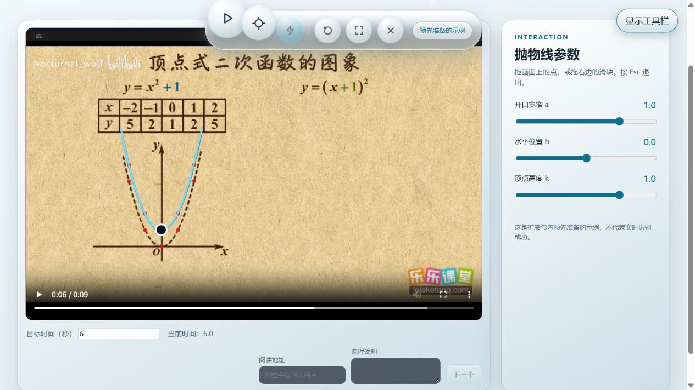

# BreakGlass 优化与验证

2026 年 10 月 3 日完成本轮优化。基于 GitHub `main` 的提交 `644a53575a5a1bac4ebb56b6d3b22af4c36524fc`，修改保存在独立目录 `D:\前端\breakglass-optimized`，原工作目录保留。本轮没有提交或推送到 GitHub。

本轮修复曲线校验、阅读取消、响应归属、滑块精度和界面入口问题，并补充检查脚本与 CI。遵循 [BreakGlass Constitution](BreakGlass-constitution.md) 与 [仓库原则](../.specify/memory/constitution.md)：数学抛物线 P0 范围不变，阅读服务仅修改已有 `breakglass-reader/`，没有新增云端服务、数据库、账号或代码执行能力。

## 已完成的优化

| 问题 | 优化后的行为 |
| --- | --- |
| 非有限数值、额外参数或零系数可能进入曲线流程 | 仅允许自身拥有的 a、h、k 参数；拒绝 NaN、Infinity、a 为零、系数范围跨零及会导致求值溢出的范围。拖动和滑块保留最后有效状态 |
| 绘制异常或零尺寸舞台可能留下空覆盖层 | 绘制失败进入可重试状态，清理覆盖层与计时；已有有效覆盖层在暂时无法重算时保留 |
| 微小系数被原生滑块对齐到邻近步点 | 滑块范围以初值为中心并使用整数步数，保持系数符号和精度；参数输出不会将有效小系数显示成零 |
| 阅读返回点可能属于未发送的帧或旧视频 | 根据本次实际发送的时间、源尺寸、视频标识、阅读标识和时长核对响应；问答也核对时长 |
| 关闭页面或断开请求后模型任务继续运行 | 取消信号传递到在途模型请求，停止领取后续帧任务，丢弃取消后的结果；正常读完请求体不会触发误取消 |
| 工具栏依赖悬停，窄屏和键盘入口不清楚 | 新增常驻“显示工具栏”按钮及焦点管理；窄屏允许工具栏换行，无悬停设备保留可见操作 |
| 宣传页封面 Esc 变空白、入口不明确 | 封面增加真实入口，封面 Esc 保持可见，文章 Esc 返回封面 |
| 装饰字符污染标题的无障碍文本 | 装饰字形使用 `aria-hidden`，保留真实正文作为可访问文本 |
| 背景持续绘制及减少动效支持不足 | 背景默认限至 30 FPS，使用实际帧间隔并释放资源；减少动效时立即导航、停用平滑滚动并在尺寸变化后重绘 |
| DOM 挂载被当成可见延迟 | 分开记录 DOM 准备与双 rAF 绘制机会估计，隐藏、退出或失败时取消计时；真实像素呈现未验证时不宣称验收通过 |

新增无依赖 `scripts/check.mjs` 和 GitHub Actions 配置。CI 使用 Node.js 24，执行语法、资源引用和全仓库测试；远程 CI 本轮未运行。

## 实际验证结果

本机 Node.js 为 v24.21.0。在优化副本根目录执行：

```bash
node scripts/check.mjs
node --test
```

| 检查 | 结果与证据 |
| --- | --- |
| 全仓库自动化测试 | **355 项通过，0 失败、取消、跳过或待办**，耗时约 4.54 秒；[完整日志](test-evidence/optimization-2026-10-03/node-test.log) |
| 静态检查 | **75 个 JS/MJS 脚本、142 处本地引用及内联脚本通过**；[完整日志](test-evidence/optimization-2026-10-03/static-check.log) |
| 桌面浏览器 | Codex 内置浏览器 1280×720，包内视频加载、定位 6 秒、破壁、键盘改参、重置、Esc 退出均通过；20 次重复唤醒与退出没有重复覆盖层 |
| 窄屏浏览器 | 实际浏览器视口 390×844，工具栏可打开、定位与破壁可用，无页面横向溢出；此项是桌面引擎的视口模拟 |
| 宣传页 | 390 像素宽封面 Esc 保持内容，入口跳转文章，文章 Esc 返回；标题可访问文本不再重复装饰字形 |
| 原生滑块精度 | 对初值 0.00012345，修复前原生控件值为 0.000121725，修复后为 0.000123449999999999，仅有约 1×10⁻¹⁸ 浮点差；[读数](test-evidence/optimization-2026-10-03/native-range.json)与[截图](test-evidence/optimization-2026-10-03/native-range.png) |

桌面演示结果：



其他截图：[390 像素演示页](test-evidence/optimization-2026-10-03/demo-narrow.png)、[封面 Esc](test-evidence/optimization-2026-10-03/site-cover-escape.png)、[文章页](test-evidence/optimization-2026-10-03/site-education.png)。

### 交互计时的含义

一次初始唤醒加 20 次重复唤醒共 21 个缓存命中样本。DOM 准备 P50 为 **1.7 ms**、P95 为 **3.5 ms**；双 rAF 绘制机会估计 P50 为 **27.3 ms**、P95 为 **35.7 ms**，最大值 **210.4 ms**。完整样本摘要见 [presentation.json](test-evidence/optimization-2026-10-03/presentation.json)。

双 rAF 只证明到达后续绘制机会，不证明显示器上的像素已呈现。这组记录不作为真实首帧延迟或 P0 性能达标证明，也没有测量真实模型阅读延迟。

## 待真实环境验收

- Chrome MV3 扩展内流程、全屏、物理触屏及真实系统减少动效设置未在本轮验证；无悬停和减少动效分支已由自动化测试覆盖。
- 四画幅、窗口变化和全屏下的实际像素对齐仍需独立测量，不能由数学映射测试替代。
- 阅读与问答测试使用模型替身，没有调用真实供应商；SC-003、SC-004、SC-005 仍未通过。
- 原生屏幕阅读器未运行，当前结论来自浏览器可访问文本与自动化断言。
- 包内视频仍为 45,789,460 字节，未完成压缩；本机没有 ffmpeg。本轮没有修改视频资源。

## 运行优化副本

使用 Chrome 在 `chrome://extensions` 加载 `D:\前端\breakglass-optimized\extension`，点击扩展图标打开演示页，然后用“显示工具栏”定位第 6 秒并破壁。该路径使用明确标记的预制示例。

网页方式需要支持 HTTP Range 的静态服务器，才能可靠定位视频；普通不支持 Range 的服务器不能用于定位验收。选择本地视频不上传整段文件；配置阅读地址后会向该地址发送最多 8 张 JPEG 帧及课程说明，详见 [README](../README.md) 和 [reader 配置](../breakglass-reader/README.md)。

补丁按上述 GitHub 提交生成。应用前应在对应版本执行 `git apply --check`，再执行 `git apply`；若目标分支已变化，应先审查差异。完整前端验证历史见 [验证记录](BreakGlass-frontend-validation.md)。
